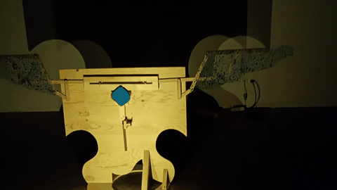
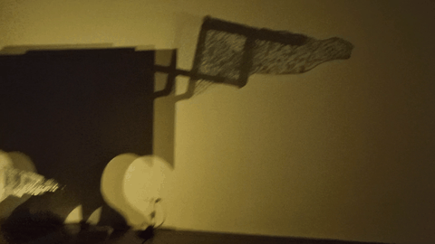

# Mechanical Wing

An art project built with a Raspberry Pi Pico, a DC motor, and an H-bridge driver to animate a mechanical wing.

## Hardware

- Raspberry Pi Pico
- DC motor
- H-bridge motor driver
